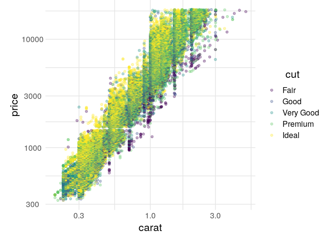
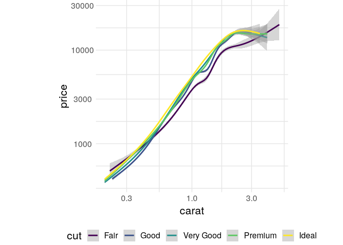
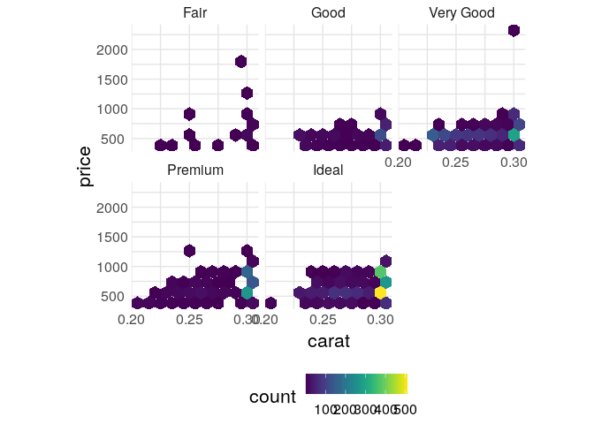
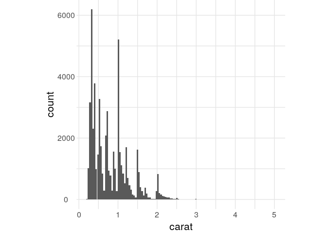
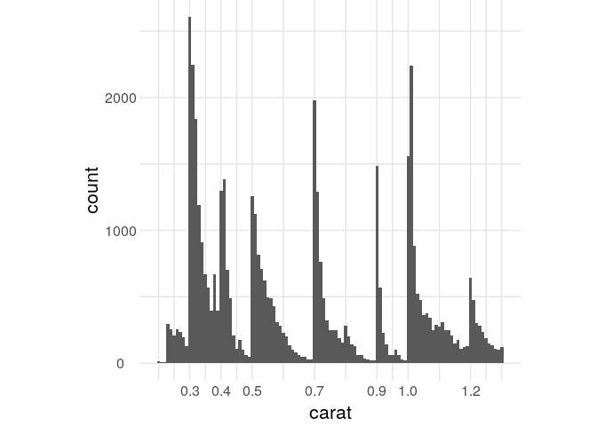

Getting Started: Diamonds
================
(Your name here)
2020-

*Purpose*: Throughout this course, you’ll complete a large number of
*exercises* and *challenges*. Exercises are meant to introduce content
with easy-to-solve problems, while challenges are meant to make you
think more deeply about and apply the content. The challenges will start
out highly-scaffolded, and become progressively open-ended.

In this challenge, you will go through the process of exploring,
documenting, and sharing an analysis of a dataset. We will use these
skills again and again in each
    challenge.

<!-- include-rubric -->

``` r
library(tidyverse)
```

    ## ── Attaching packages ─────────────────────────────────────── tidyverse 1.3.0 ──

    ## ✔ ggplot2 3.3.1     ✔ purrr   0.3.4
    ## ✔ tibble  3.0.1     ✔ dplyr   1.0.0
    ## ✔ tidyr   1.1.0     ✔ stringr 1.4.0
    ## ✔ readr   1.3.1     ✔ forcats 0.5.0

    ## ── Conflicts ────────────────────────────────────────── tidyverse_conflicts() ──
    ## ✖ dplyr::filter() masks stats::filter()
    ## ✖ dplyr::lag()    masks stats::lag()

``` r
library(rzdr)
```

# Data Exploration

<!-- -------------------------------------------------- -->

In this first stage, you will explore the `diamonds` dataset and
document your observations.

**q1** Create a plot of `price` vs `carat` of the `diamonds` dataset
below. Document your observations from the visual.

*Hint*: We learned how to do this in `e-vis00-basics`\!

``` r
## TASK: Plot `price` vs `carat` below
diamonds %>%
  ggplot(aes(carat, price)) +
  geom_point()
```

<!-- -->

**Observations**:

  - `price` generally increases with `carat`
  - The trend is not ‘clean’; there is no single curve in the
    relationship

**q2** Create a visualization showing variables `carat`, `price`, and
`cut` simultaneously. Experiment with which variable you assign to which
aesthetic (`x`, `y`, etc.) to find an effective visual.

``` r
## TASK: Plot `price`, `carat`, and `cut` below
diamonds %>%
  ggplot(aes(carat, price, color = cut)) +
  geom_point(alpha = 1 / 3) +
  scale_x_log10() +
  scale_y_log10() +
  theme_common()
```

<!-- -->

**Observations**:

  - `price` generally increases with `carat`
      - Furthermore the trend is roughly linear on a log-log scale; this
        implies a power-law relation between `price` and `carat`
  - The `cut` helps explain the variation in price;
      - `Ideal` cut diamonds tend to be more expensive
      - `Fair` cut diamonds tend to be less expensive

**Elaboration**:

The figure above is rather busy; let’s make a simpler visual with
smoothed trends.

``` r
diamonds %>%
  ggplot(aes(carat, price, color = cut)) +
  geom_smooth() +
  scale_x_log10() +
  scale_y_log10() +
  theme_common() +
  theme(legend.position = "bottom")
```

    ## `geom_smooth()` using method = 'gam' and formula 'y ~ s(x, bs = "cs")'

<!-- -->

**Observations**:

  - The relationships between `price` and `carat` is very nearly linear
    when plotted on a log-log scale\!
      - Furthermore, the slope seems to be constant across different
        `cut` values.
  - At low `carat`, the `Fair` diamonds appear to be the most expensive.
    Is this a real trend?
      - Note that the confidence band for `Fair` overlaps the other
        curves, so this is already not a robust conclusion.
  - At very high `carat`, the price of `Fair` diamonds again become most
    expensive.

Let’s follow up the low-carat diamonds:

``` r
diamonds %>%
  filter(carat <= 0.3) %>%

  ggplot(aes(carat, price)) +
  geom_hex(bins = 10) +

  scale_x_continuous(breaks = c(0.2, 0.25, 0.3)) +
  viridis::scale_fill_viridis() +
  facet_wrap(~cut) +
  theme_common() +
  theme(legend.position = "bottom")
```

<!-- -->

**Observations**:

  - The `Fair` observations are far more sparse than other `cut`s in the
    `carat <= 0.3` range.
  - Based on observation, the bulk of `Fair` diamonds do not appear to
    be of especially high `price`.
      - However, there is an outlier in `price` at `carat` near `0.3`.
        This may be dragging the trend line up.
  - Ultimately, the small sample size, edge effect, and the outlier can
    explain the odd phenomenon with `Fair` in the smoothed trend above.
    This casts doubt on the conclusions that small `Fair` diamonds are
    genuinely more expensive.

# Bonus Observations

We haven’t gotten to this point in the exercise sequence yet, but it’s
usually a good idea to start with 1-dimensional investigations of the
data when doing EDA. There’s a very interesting pattern just within the
distribution `carat` values.

``` r
diamonds %>%
  ggplot(aes(carat)) +
  geom_histogram(bins = 120) +
  theme_common()
```

<!-- -->

**Observations**:

  - Even with a large number of bins there are very tall peaks. Let’s
    zoom in a bit to inspect closer.

<!-- end list -->

``` r
wid <- 0.01
diamonds %>%
  filter(carat <= 1.3) %>%
  ggplot(aes(carat)) +
  geom_histogram(boundary = wid / 2, binwidth = wid) +
  scale_x_continuous(
    breaks = c(0.3, 0.4, 0.5, 0.7, 0.9, 1, 1.2)
  ) +
  theme_common()
```

<!-- -->

**Observations**:

  - There appear to be peaks in `carat` at particular `0.1` increments.
  - These peaks tend to have a sharp drop to their left (lower values),
    with a slower dropoff to their right (higher values).
  - Since these diamonds are meant for sale, these patterns are likely
    reflect the desires of the market: i.e. people desire diamonds at
    these specific carat values, and will buy diamonds slightly above
    (but not slightly below) those values.
